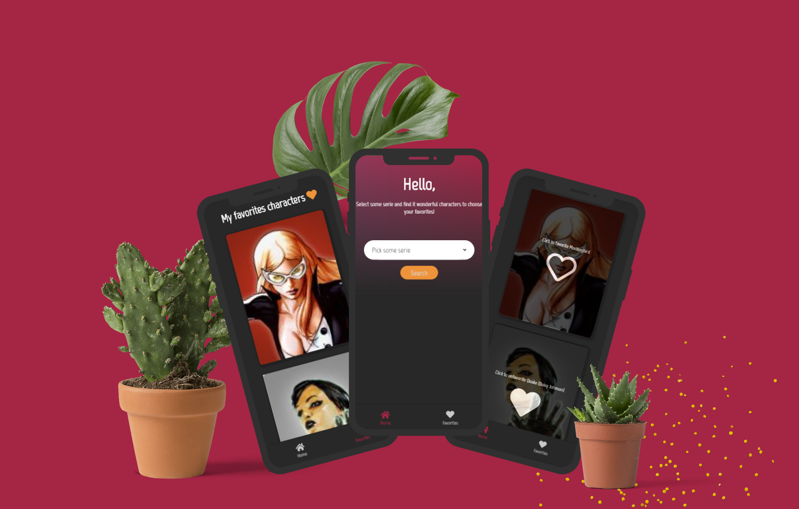

<h3 align="center">
    
    <br>
</h3>

<p align="center"> Projeto desenvolvido utilizando a API da Marvel. </p>

## O que é o My fav heroes?

O "My fav heroes" é uma aplicação onde é possível escolher uma série da Marvel e então, a partir da lista de seus personagens, escolher seus favoritos e adicioná-los à sua lista!

## Tecnologias Utilizadas

O projeto foi desenvolvido utilizando VueJS e integração com a API da Marvel (https://developer.marvel.com/docs/).

## Manual de utilização

### 1. Clonar o projeto em seu computador.

### 2. Instalação
Para instalar as dependências e executar:

```bash
npm install
npm run serve
```

<h4 align="center">
    Projeto por <a href="https://www.linkedin.com/in/gabriele-jandres-cavalcanti-249107175/" target="_blank"> Gabriele Jandres </a>
</h4>
